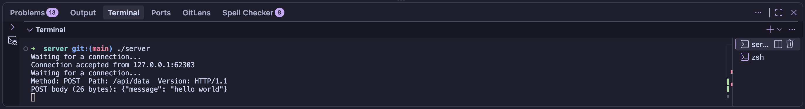
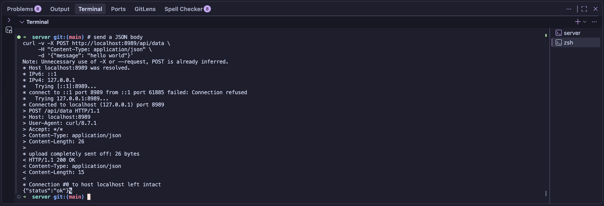

# Multi-Threaded HTTP Server — C++17

A multi-threaded HTTP/1.1 web server built from scratch in C++ using POSIX sockets and a fixed-size thread pool. The server serves static files, processes HTTP requests concurrently, and demonstrates systems programming concepts including networking, synchronization, and resource management.

> **Status:** Functional. Supports HTTP GET and POST requests for educational purposes.

---

## Screenshot


---

## About

This project was built to better understand how web servers work under the hood. Instead of relying on existing web frameworks, the server uses low-level POSIX socket APIs and modern C++ concurrency primitives to implement HTTP request handling from scratch.

The project demonstrates:

- TCP socket programming
- HTTP/1.1 request parsing
- Multi-threaded request processing
- Thread synchronization
- Resource management using RAII
- Static file serving

---

## Features

### Networking

- TCP server using POSIX sockets
- IPv4 support
- Configurable listening port
- Connection backlog for pending clients
- Automatic socket cleanup using RAII

### HTTP Support

- HTTP/1.1 request parsing
- Supports **GET** requests
- Supports **POST** requests
- Returns appropriate HTTP status codes:
  - `200 OK`
  - `400 Bad Request`
  - `404 Not Found`
  - `405 Method Not Allowed`
  - `500 Internal Server Error`

### Static File Serving

- Serves files from the project directory
- Automatic `Content-Length` generation
- MIME type detection for common file types:
  - HTML
  - CSS
  - JavaScript
  - PNG
  - JPEG
  - JSON
  - Text files
- Streams files in chunks instead of loading entire files into memory

### Thread Pool

- Fixed-size worker thread pool
- Thread-safe client connection queue
- Producer-consumer architecture
- Synchronization using:
  - `std::mutex`
  - `std::condition_variable`
  - `std::unique_lock`
- Graceful thread shutdown

### Resource Management

- RAII wrapper for server socket
- Automatic cleanup of sockets
- Automatic joining of worker threads
- Copy prevention for socket ownership

---

## Project Structure

| File | Purpose |
|------|---------|
| `server.cpp` | Main server implementation |
| `index.html` | Example webpage served by the server |
| `style.css` | Example stylesheet |
| `client.rb` | Simple Ruby client used for testing |
| `manyclients.bash` | Stress test that launches multiple concurrent clients |
| `Makefile` | Build configuration |

---

## Running the Server

Build the project:

```bash
make
```

Start the server:

```bash
./server
```

Open your browser and navigate to:

```
http://localhost:8989
```

The server will serve the included HTML page.

---

## Concurrency Design

Incoming client connections are accepted on the main thread and placed into a synchronized queue.

Worker threads continuously wait for available work using a condition variable. When a new client connects:

1. Main thread accepts the connection.
2. Client socket is pushed into the queue.
3. One worker thread wakes.
4. The worker processes the HTTP request.
5. The response is sent.
6. The connection is closed.
7. The worker returns to waiting for the next client.

This producer-consumer design avoids creating a new thread for every incoming connection while allowing multiple clients to be served concurrently.

### Server Output



---

## Example HTTP Response

```http
GET / HTTP/1.1

HTTP/1.1 200 OK
Content-Type: text/html
Content-Length: 216
```

### POST Request Example



---

## Future Improvements

Potential enhancements include:

- Persistent HTTP connections (Keep-Alive)
- Directory traversal protection
- HTTP routing for dynamic endpoints
- Additional HTTP methods (PUT, DELETE, etc.)
- Logging framework
- HTTPS/TLS support
- Performance benchmarking
- Unit tests
- Configurable thread pool size

---

## Building

### Requirements

- C++17
- POSIX-compatible operating system (Linux/macOS)
- Clang or GCC

Build:

```bash
make
```

Run:

```bash
./server
```

---

## License

Provided as-is for educational and portfolio purposes.
