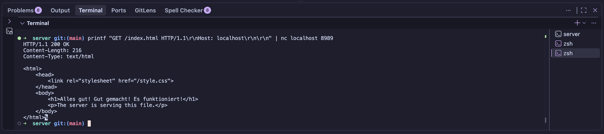

# Multi-Threaded HTTP Server

A multi-threaded HTTP/1.1 web server built from scratch in C++ using POSIX sockets and a fixed-size thread pool. The server serves static files, processes HTTP requests concurrently, and demonstrates systems programming concepts including networking, synchronization, and resource management.

---

## Screenshot



---

## About

This project was built to better understand how web servers work under the hood. Instead of relying on existing web frameworks, the server uses low-level POSIX socket APIs and modern C++ concurrency primitives to implement HTTP request handling from scratch.

The project demonstrates:

- TCP socket programming
- HTTP/1.1 request parsing
- Multi-threaded request processing
- Thread synchronization
- Resource management using RAII
- Static file serving

---

## Features

### Networking

- TCP server using POSIX sockets
- IPv4 support
- Configurable listening port
- Connection backlog for pending clients
- Automatic socket cleanup using RAII

### HTTP Support

- HTTP/1.1 request parsing
- Supports **GET** requests
- Supports **POST** requests
- Returns appropriate HTTP status codes:
  - `200 OK`
  - `400 Bad Request`
  - `404 Not Found`
  - `405 Method Not Allowed`
  - `500 Internal Server Error`

### Static File Serving

- Serves files from the project directory
- Automatic `Content-Length` generation
- MIME type detection for common file types:
  - HTML
  - CSS
  - JavaScript
  - PNG
  - JPEG
  - JSON
  - Text files
- Streams files in chunks instead of loading entire files into memory

### Thread Pool

- Fixed-size worker thread pool
- Thread-safe client connection queue
- Producer-consumer architecture
- Synchronization using:
  - `std::mutex`
  - `std::condition_variable`
  - `std::unique_lock`
- Graceful thread shutdown

### Resource Management

- RAII wrapper for server socket
- Automatic cleanup of sockets
- Automatic joining of worker threads
- Copy prevention for socket ownership

---

## Running the Server

Build the project:

```bash
make
```

Start the server:

```bash
./server
```

Open your browser and navigate to:

```
http://localhost:8989
```
---
